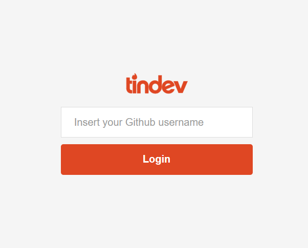
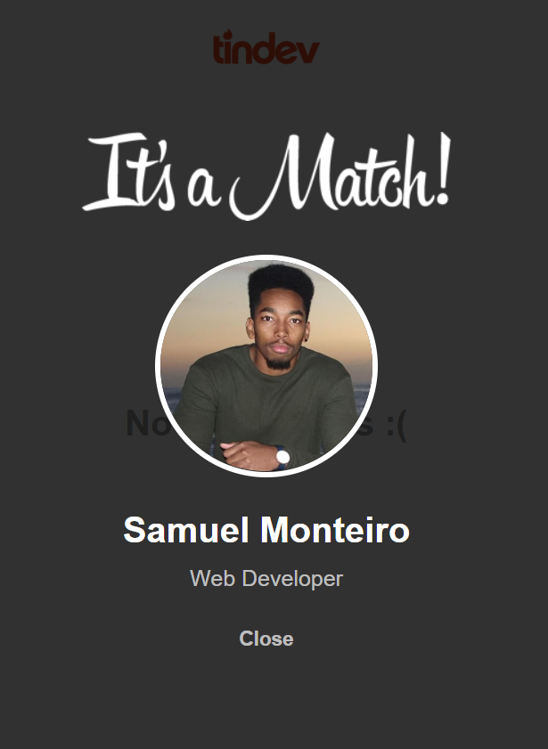

# tindev


Do you ever imagine a ```tinder``` app for developers? An application where devs can find each other and macth one another. Tindev is all about that. Created with **React.js(web version)**, **React Native(mobile version)** and using **socket.io** to comunicate with the backend in real time.

 

## How to set up the project

### Web version
#### Backend
To run your backend server go into the folder backend through the command line and run the command ```npm install``` or ```yarn add``` in case you have **yarn** installed on your machine, in order to install all the require dependencies.

Once you have done that you can execute the command ```npm start``` or ```yarn start``` to run your server. A message should appear in your command line indicaditng that your server is up.

```sh
$ cd backend
$ npm install or yarn add
$ npm start or yarn start
```
#### Frontend
In the same way you have done in the backend go into your frontend folder through the command line and execute ```npm install``` or ```yarn add``` to install all the required dependencies.

After execute ```npm start``` or ```yarn start``` to execute the app. A message will appears indicating that the port 3000 is alread bing used and asking to if it can use another port. Say yes (y) and automaticly a web page in the bowser is open and you will be good to go.

```sh
$ cd frontend
$ npm install or yarn add
$ npm start or yarn start
```

### Mobile version
Sadly i couldn't upload the react native project because it is too large.

  
